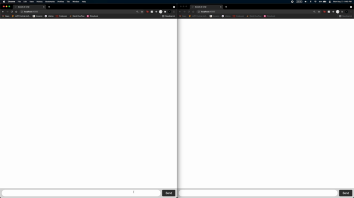

# socket-chat-example

This is an example of using socket.io for chatting on the web application

Clone the repo and run `npm install` and then run `npm start` to get the application working

## Here's a demo of the practice

